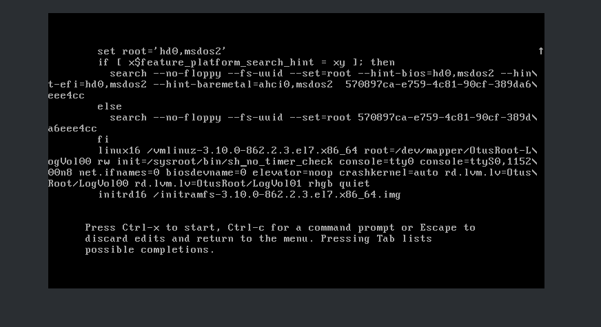

# otus_linux_dz8_grub

1. Попасть в систему без паролā несколþкими способами
2. Установитþ систему с LVM, после чего переименоватþ VG
3. Добавитþ модуль в initrd

### 1

на меню загрузки переходим в редактирование черех  e




### 2

Смотрим название lvm gropup и переменовываем


после переменовываем в файлах и переконфигурируем

```

for i in /etc/fstab /etc/default/grub /boot/grub2/grub.cfg; do sed -ibak 's/VolGroup00/OtusRoot/g' "$i"; done

mkinitrd -f -v /boot/initramfs-$(uname -r).img $(uname -r)
```

перезагружаем и проверяем название групп


### 3

по пути /usr/lib/dracut/modules.d/01test создаем скрипты


переконфигурируем загрузчик, проверяем дополнительные модулии перезагружаемся


